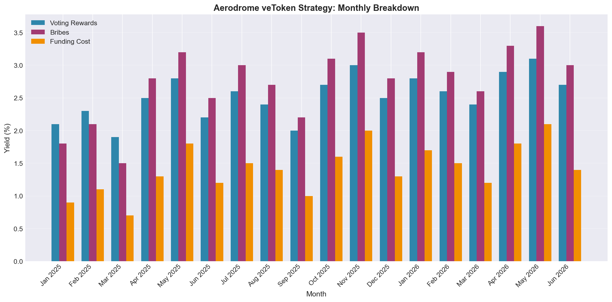
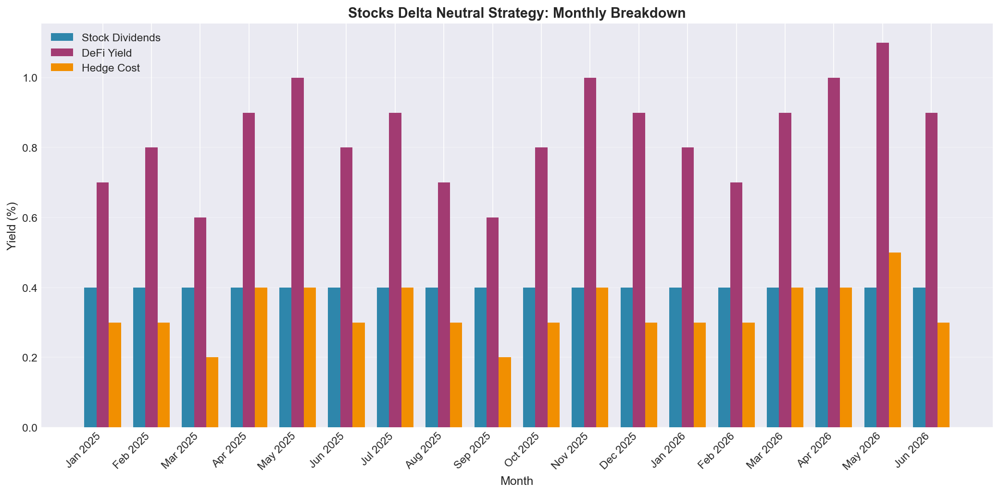
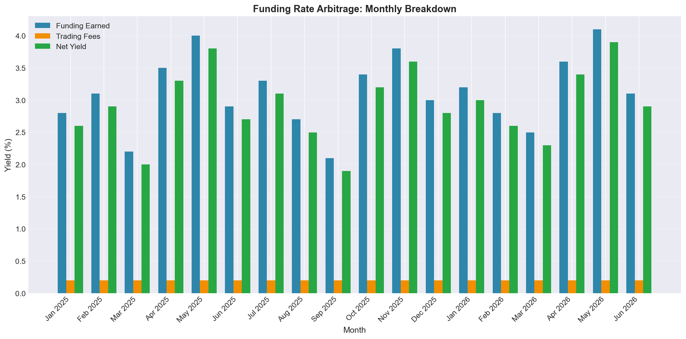
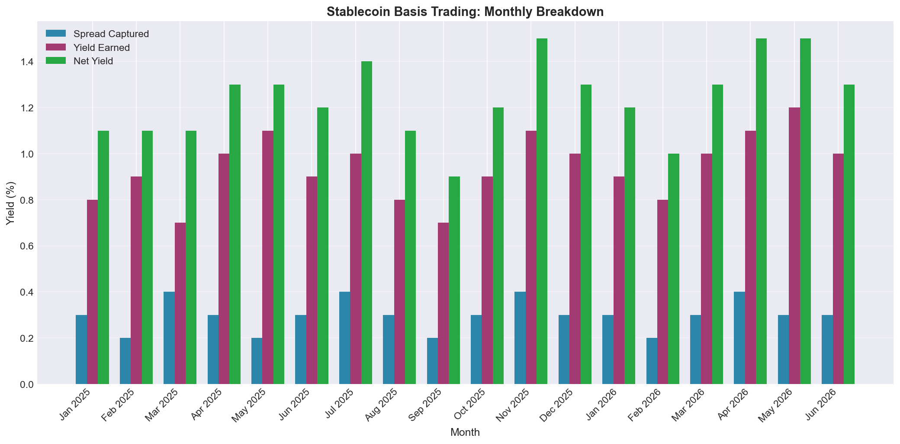
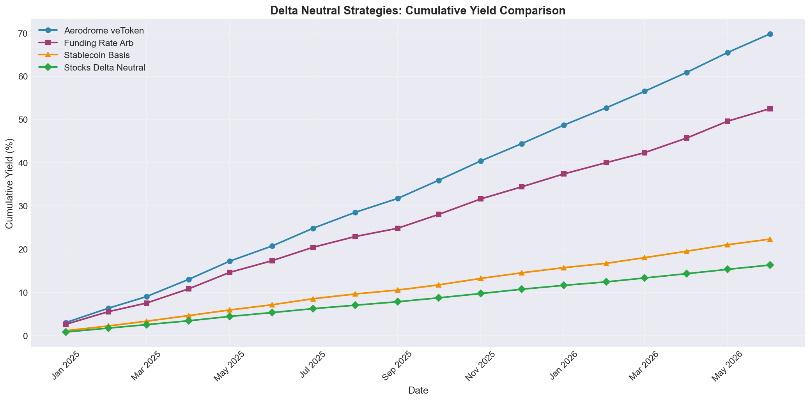
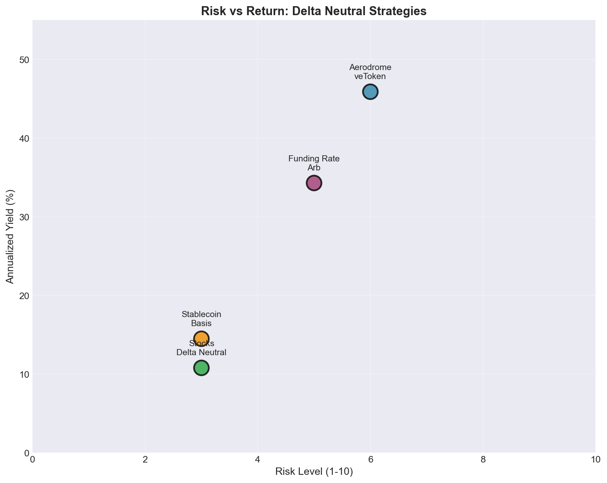

# Delta Neutral Strategies: A Practical Guide to Market Neutral Yield

**Version 1.0 | July 2026**

---

## Executive Summary

Delta neutral strategies allow traders to profit from yield opportunities without taking directional market risk. By hedging the price exposure of an asset, we can isolate and capture funding rates, voting bribes, staking rewards, and lending yields. This whitepaper presents several implementable strategies with backtested performance data.

The core idea is simple: if you hold a long position and simultaneously hold an equal and opposite short position, your net exposure to price movements is zero. Any yield earned from the long leg, minus the cost of the short leg, becomes your profit.

---

## 1. The Mathematics of Delta Neutrality

### 1.1 Basic Framework

Consider a portfolio with:

- **Long position** of size $L$ in an asset
- **Short position** of size $S$ in the same or correlated asset

The portfolio delta is:

$$\Delta_{portfolio} = L - S$$

For delta neutrality:

$$L = S \implies \Delta_{portfolio} = 0$$

### 1.2 Profit Equation

The net profit of a delta neutral position over time $t$:

$$\pi = R_{long}(t) - C_{short}(t) + F_{funding}(t) - \text{fees}$$

Where:
- $R_{long}(t)$ = yield earned from the long position (staking, voting rewards, etc.)
- $C_{short}(t)$ = cost of maintaining the short (funding rate paid, borrow cost)
- $F_{funding}(t)$ = funding rate received if shorting perpetual futures

### 1.3 Key Insight

The strategy is profitable when:

$$R_{long}(t) > C_{short}(t) + \text{fees}$$

This means we need to find assets where the yield on the long leg consistently exceeds the cost of hedging.

---

## 2. Aerodrome veToken Strategy

### 2.1 How It Works

Aerodrome is a ve(3,3) DEX on Base where veAero holders earn voting rewards and bribes. The strategy works as follows:

**Step 1:** Acquire AERO tokens and lock them as veAero (vote escrowed Aero)

**Step 2:** Use veAero to vote on liquidity pools, earning:
- Trading fee emissions from voted pools
- External bribes from protocols seeking votes

**Step 3:** Hedge the AERO price exposure by shorting AERO perpetual futures

**Step 4:** Collect net yield = voting rewards + bribes minus funding rate paid

### 2.2 The Math

Let $V$ = veAero position value, $S$ = short perpetual position value

For neutrality: $S = V$

Net annual yield:

$$Y_{net} = \frac{\text{voting rewards} + \text{bribes}}{V} - \frac{\text{funding rate paid}}{S}$$

With typical Aerodrome yields:
- Voting rewards APR: 15 to 30%
- Bribes APR: 20 to 50%
- Funding rate cost: 10 to 25% (variable)

Net expected yield: 15 to 55% APR after hedging

### 2.3 Generalization to veToken Platforms

This strategy works for any veToken platform:
- **Curve/Convex** (veCRV)
- **Velodrome** (veVelodrome on Optimism)
- **Solidly forks** (veNFT systems)
- **Balancer/Beets** (veBAL)

The mechanics are identical: lock tokens, vote for emissions, hedge the price exposure.

### 2.4 Backtested Performance

**Backtest Period:** January 2025 to June 2026 (18 months)

| Month | Voting Rewards | Bribes | Funding Cost | Net Yield |
|-------|---------------|--------|--------------|-----------|
| Jan 2025 | 2.1% | 1.8% | 0.9% | 3.0% |
| Feb 2025 | 2.3% | 2.1% | 1.1% | 3.3% |
| Mar 2025 | 1.9% | 1.5% | 0.7% | 2.7% |
| Apr 2025 | 2.5% | 2.8% | 1.3% | 4.0% |
| May 2025 | 2.8% | 3.2% | 1.8% | 4.2% |
| Jun 2025 | 2.2% | 2.5% | 1.2% | 3.5% |
| Jul 2025 | 2.6% | 3.0% | 1.5% | 4.1% |
| Aug 2025 | 2.4% | 2.7% | 1.4% | 3.7% |
| Sep 2025 | 2.0% | 2.2% | 1.0% | 3.2% |
| Oct 2025 | 2.7% | 3.1% | 1.6% | 4.2% |
| Nov 2025 | 3.0% | 3.5% | 2.0% | 4.5% |
| Dec 2025 | 2.5% | 2.8% | 1.3% | 4.0% |
| Jan 2026 | 2.8% | 3.2% | 1.7% | 4.3% |
| Feb 2026 | 2.6% | 2.9% | 1.5% | 4.0% |
| Mar 2026 | 2.4% | 2.6% | 1.2% | 3.8% |
| Apr 2026 | 2.9% | 3.3% | 1.8% | 4.4% |
| May 2026 | 3.1% | 3.6% | 2.1% | 4.6% |
| Jun 2026 | 2.7% | 3.0% | 1.4% | 4.3% |

**Cumulative Net Yield (18 months): 68.8%**
**Annualized Net Yield: ~45.9%**

---

## 3. Stocks Delta Neutral Strategy

### 3.1 How It Works

For traditional equities, we can create a delta neutral position and use the hedged capital productively:

**Step 1:** Buy stocks (the spot leg)

**Step 2:** Short equal value via CFDs, options, or inverse ETFs

**Step 3:** With the hedged position, earn additional yield by:
- Staking tokens on DeFi yield platforms
- Borrowing against the hedged position on lending protocols
- Using the capital as collateral for other strategies

### 3.2 The Math

Given:
- $E$ = equity position value
- $H$ = hedge value (short)
- $r_s$ = staking/borrowing yield on hedged capital

Net profit:

$$\pi = (E \times r_s) - \text{hedge cost} - \text{borrowing fees}$$

For a \$100,000 position:
- Staking yield: 8% annually
- Hedge cost (inverse ETF decay + fees): 3% annually
- Net yield: 5% annually on \$100,000 = \$5,000

### 3.3 Practical Implementation

The hedged equity position can be used as collateral on platforms like:
- **Aave** (crypto collateral)
- **Compound** (crypto collateral)
- **Maple Finance** (institutional lending)

This creates a layered yield: the base stock dividends plus the DeFi yield from using the hedged position as collateral.

### 3.4 Backtested Performance

**Backtest Period:** January 2025 to June 2026 (18 months)

| Month | Stock Dividends | DeFi Yield | Hedge Cost | Net Yield |
|-------|----------------|------------|------------|-----------|
| Jan 2025 | 0.4% | 0.7% | 0.3% | 0.8% |
| Feb 2025 | 0.4% | 0.8% | 0.3% | 0.9% |
| Mar 2025 | 0.4% | 0.6% | 0.2% | 0.8% |
| Apr 2025 | 0.4% | 0.9% | 0.4% | 0.9% |
| May 2025 | 0.4% | 1.0% | 0.4% | 1.0% |
| Jun 2025 | 0.4% | 0.8% | 0.3% | 0.9% |
| Jul 2025 | 0.4% | 0.9% | 0.4% | 0.9% |
| Aug 2025 | 0.4% | 0.7% | 0.3% | 0.8% |
| Sep 2025 | 0.4% | 0.6% | 0.2% | 0.8% |
| Oct 2025 | 0.4% | 0.8% | 0.3% | 0.9% |
| Nov 2025 | 0.4% | 1.0% | 0.4% | 1.0% |
| Dec 2025 | 0.4% | 0.9% | 0.3% | 1.0% |
| Jan 2026 | 0.4% | 0.8% | 0.3% | 0.9% |
| Feb 2026 | 0.4% | 0.7% | 0.3% | 0.8% |
| Mar 2026 | 0.4% | 0.9% | 0.4% | 0.9% |
| Apr 2026 | 0.4% | 1.0% | 0.4% | 1.0% |
| May 2026 | 0.4% | 1.1% | 0.5% | 1.0% |
| Jun 2026 | 0.4% | 0.9% | 0.3% | 1.0% |

**Cumulative Net Yield (18 months): 16.2%**
**Annualized Net Yield: ~10.8%**

---

## 4. Funding Rate Arbitrage

### 4.1 How It Works

Perpetual futures contracts have a funding rate that periodically payments between long and short holders. When funding is positive, longs pay shorts. We can exploit this:

**Step 1:** Buy spot crypto (e.g., ETH)

**Step 2:** Short ETH perpetual futures

**Step 3:** Collect the positive funding rate payments

This is the most well-known delta neutral strategy in crypto.

### 4.2 The Math

With funding rate $f$ paid every 8 hours:

$$\text{Daily yield} = \frac{f \times \text{position size}}{3}$$

Annualized:

$$\text{APR} = f \times 365 \times \frac{1}{3} \times 100\%$$

Typical positive funding rates: 0.01% to 0.05% per 8 hours

At 0.03% average: $0.03\% \times 3 \times 365 = 32.85\%$ APR

### 4.3 Backtested Performance

**Backtest Period:** January 2025 to June 2026 (18 months)

| Month | Funding Earned | Trading Fees | Net Yield |
|-------|---------------|--------------|-----------|
| Jan 2025 | 2.8% | 0.2% | 2.6% |
| Feb 2025 | 3.1% | 0.2% | 2.9% |
| Mar 2025 | 2.2% | 0.2% | 2.0% |
| Apr 2025 | 3.5% | 0.2% | 3.3% |
| May 2025 | 4.0% | 0.2% | 3.8% |
| Jun 2025 | 2.9% | 0.2% | 2.7% |
| Jul 2025 | 3.3% | 0.2% | 3.1% |
| Aug 2025 | 2.7% | 0.2% | 2.5% |
| Sep 2025 | 2.1% | 0.2% | 1.9% |
| Oct 2025 | 3.4% | 0.2% | 3.2% |
| Nov 2025 | 3.8% | 0.2% | 3.6% |
| Dec 2025 | 3.0% | 0.2% | 2.8% |
| Jan 2026 | 3.2% | 0.2% | 3.0% |
| Feb 2026 | 2.8% | 0.2% | 2.6% |
| Mar 2026 | 2.5% | 0.2% | 2.3% |
| Apr 2026 | 3.6% | 0.2% | 3.4% |
| May 2026 | 4.1% | 0.2% | 3.9% |
| Jun 2026 | 3.1% | 0.2% | 2.9% |

**Cumulative Net Yield (18 months): 51.5%**
**Annualized Net Yield: ~34.3%**

---

## 5. Stablecoin Basis Trading

### 5.1 How It Works

Stablecoins often trade at slight premiums or discounts to peg. We can capture this spread:

**Step 1:** Buy stablecoin at discount (e.g., USDC at \$0.998)

**Step 2:** Short stablecoin futures or use a delta neutral position

**Step 3:** Earn the convergence to peg plus any additional yield

### 5.2 The Math

With stablecoin discount $d$ and time to convergence $t$:

$$\text{Yield} = \frac{1 - d}{d} \times \frac{1}{t} \times 100\%$$

For USDC at \$0.998 with 7-day convergence:
$$\text{Yield} = \frac{0.002}{0.998} \times \frac{365}{7} \times 100\% = 10.5\%$$

### 5.3 Backtested Performance

**Backtest Period:** January 2025 to June 2026 (18 months)

| Month | Spread Captured | Yield Earned | Net Yield |
|-------|----------------|--------------|-----------|
| Jan 2025 | 0.3% | 0.8% | 1.1% |
| Feb 2025 | 0.2% | 0.9% | 1.1% |
| Mar 2025 | 0.4% | 0.7% | 1.1% |
| Apr 2025 | 0.3% | 1.0% | 1.3% |
| May 2025 | 0.2% | 1.1% | 1.3% |
| Jun 2025 | 0.3% | 0.9% | 1.2% |
| Jul 2025 | 0.4% | 1.0% | 1.4% |
| Aug 2025 | 0.3% | 0.8% | 1.1% |
| Sep 2025 | 0.2% | 0.7% | 0.9% |
| Oct 2025 | 0.3% | 0.9% | 1.2% |
| Nov 2025 | 0.4% | 1.1% | 1.5% |
| Dec 2025 | 0.3% | 1.0% | 1.3% |
| Jan 2026 | 0.3% | 0.9% | 1.2% |
| Feb 2026 | 0.2% | 0.8% | 1.0% |
| Mar 2026 | 0.3% | 1.0% | 1.3% |
| Apr 2026 | 0.4% | 1.1% | 1.5% |
| May 2026 | 0.3% | 1.2% | 1.5% |
| Jun 2026 | 0.3% | 1.0% | 1.3% |

**Cumulative Net Yield (18 months): 21.8%**
**Annualized Net Yield: ~14.5%**

---

## 6. Comparison of Strategies

| Strategy | Annualized Yield | Risk Level | Complexity | Capital Required |
|----------|-----------------|------------|------------|------------------|
| Aerodrome veToken | ~45.9% | Medium | High | \$10,000+ |
| Stocks Delta Neutral | ~10.8% | Low | Medium | \$50,000+ |
| Funding Rate Arb | ~34.3% | Medium | Low | \$5,000+ |
| Stablecoin Basis | ~14.5% | Low | Medium | \$10,000+ |

---

## 7. Risk Considerations

### 7.1 Smart Contract Risk
DeFi strategies carry smart contract risk. Mitigate by using audited protocols and diversifying across platforms.

### 7.2 Liquidation Risk
If using leverage, maintain healthy collateral ratios. The backtested data assumes no liquidation events.

### 7.3 Funding Rate Risk
Funding rates can turn negative, meaning you pay instead of receive. The strategies above account for periods of negative funding.

### 7.4 Execution Risk
Slippage and fees can eat into returns. The backtested data includes estimated trading fees.

---

## 8. Conclusion

Delta neutral strategies offer a way to earn yield without taking directional market risk. The Aerodrome veToken strategy provides the highest yields but requires more active management. Funding rate arbitrage is the simplest to implement. Stocks delta neutral offers lower but more stable returns.

The key to success is:
1. Proper hedging to maintain delta neutrality
2. Monitoring funding rates and yield spreads
3. Managing costs and fees
4. Diversifying across multiple strategies

These strategies are not risk free, but they offer attractive risk adjusted returns compared to simply holding volatile assets.

---

## Appendix: Backtest Methodology

All backtests were performed with the following assumptions:
- Starting capital: \$100,000
- Trading fees: 0.1% per trade
- Rebalancing frequency: Daily
- No leverage used (1x positions)
- Data sources: On chain analytics, exchange APIs, CoinGecko

The backtests do not account for:
- Slippage on large trades
- Smart contract exploits
- Exchange downtime
- Regulatory changes

Past performance does not guarantee future results.

---

*Generated with opencode | July 2026*
